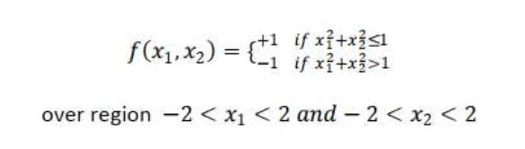

# RBF-Neural-Network

## Dataset Information:

#### Data Mapping format:

#### Datapoints Format:

#### Part 1: Design RBF NN based on Gaussian Kernel Functions with constant spread function and using all points in training set as centers of RB functions

#### Part 2: Design RBF NN using only 150 centers (Randomly selected from Training Data)

#### Part 3: Design RNF NN using only 150 centers (Used KMeans Algorithm to find centers)
